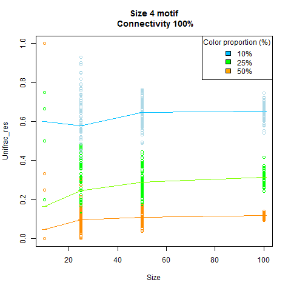
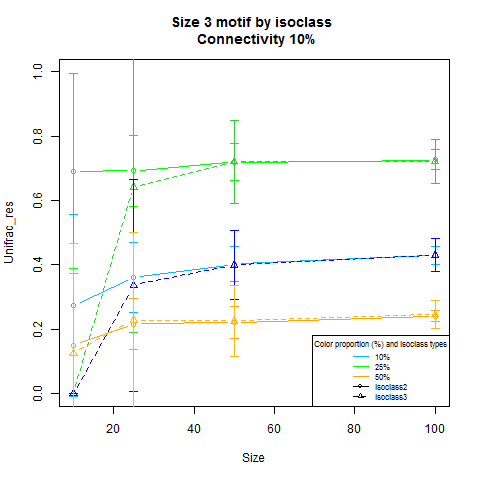

### Global Unifrac_res by motif size  
  
#### Size 2 motif    


#### Size 3 motif  


  
#### Size 4 motif  



  
52 NaN values for size 4 motif:  
Graph numbers: 1,6,11   
  -Size 10 and connectivity 10%
  
### Unifrac_res by motif size and types  
  
#### Size 3 motif types  



  
NaN values for size 3 motif types:  
  
Graph numbers isoclass2: 5,10,15,20,25,30,35,40,45,50,55,60 (1204 NaN values)  
  -Connectivity 100%  
   
Graph numbers isoclass3: 1,6,7,11,21,26,16 (356 NaN values)  
  -Size 10 and connectivty 10%  
  -Size 25 and connectivity 10%  
  
  
#### Size 4 motif types  


  Only isoclass10 has values other than NaN.  
  
NaN values for size 4 motif types:  
  
Graph numbers isoclass4: 1,4,5,10,15,20,25,30,35,40,45,50,55,60,6,11 (1439 NaN values)  
  
Graph numbers isoclass6: 5,6,10,11,15,20,25,30,35,40,45,50,55,60 (1284 NaN values)  
  
Graph numbers isoclass7: 1,5,6,7,10,11,15,20,21,25,30,35,40,45,50,55,60 (1568 NaN values)  
  
Graph numbers isoclass8: 1,5,6,10,11,12,15,20,25,30,35,40,45,50,55,60 (1607 NaN values)  
  
Graph numbers isoclass9: 1,5,6,7,10,11,12,15,16,20,21,25,30,35,40,45,50,55,60 (1887 NaN values)     
   
Graph numbers isoclass10: 1,2,6,7,8,11,12,16,21,26,31,36,41 (1204 NaN values)    
  
  -size 10  
  -connectivity 100%  
  
### Graph Informations  

```{r, echo=FALSE, message=FALSE,warning=FALSE, eval=T,results="asis"}
require(googleVis)
op <- options(gvis.plot.tag='chart')
rs  = get(load("C:/Users/Tissicca/Documents/GitHub/TissUni/examples/R_objects_sim/R_objects_sim/sommaire_graphs_simulation.r"))
rs=rs[[1]]
tb = gvisTable(rs, options=list(page='enable', height='automatic', width='automatic'))
plot(tb)
```
  
edges.nb.by.vertex= ((total_nodes*(total_nodes-1))/2
)/total_nodes  
mean.degree= degree(V(graph))  